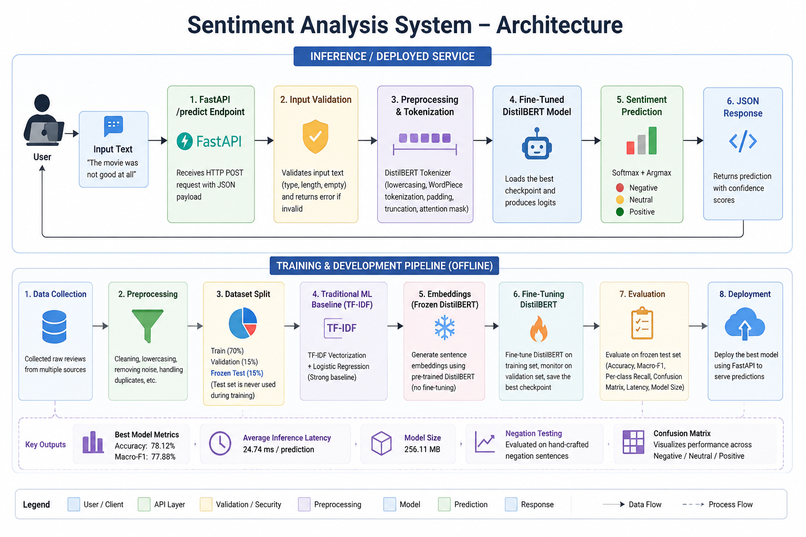

# Sentiment Analysis API

A production-ready sentiment analysis system that classifies text into **Negative**, **Neutral**, and **Positive** sentiments using a fine-tuned DistilBERT model. The project was developed throughout an AI internship, progressing from traditional machine learning methods to transformer-based models and finally deploying the best-performing model as a REST API using FastAPI.

---

## Project Overview

This project demonstrates the complete lifecycle of a sentiment analysis system, including data preparation, model development, evaluation, deployment, and documentation.

The project evolved through multiple stages:

- TF-IDF + Logistic Regression baseline
- Frozen DistilBERT embeddings
- Fine-tuned DistilBERT
- FastAPI deployment
- Evaluation using a frozen test set
- Hugging Face deployment

The final system provides sentiment predictions through a REST API while following fair evaluation practices and reproducible machine learning workflows.

---

## Features

- Fine-tuned DistilBERT sentiment classifier
- Three sentiment classes (Negative, Neutral, Positive)
- REST API built with FastAPI
- Hugging Face deployment
- Frozen test-set evaluation
- Classification report generation
- Confusion matrix visualization
- Negation testing
- Inference latency measurement

---

## System Architecture



---

## Project Pipeline

```
Dataset
        │
        ▼
Data Cleaning & Preprocessing
        │
        ▼
Train / Validation / Frozen Test Split
        │
        ▼
TF-IDF Baseline
        │
        ▼
Frozen DistilBERT Embeddings
        │
        ▼
Fine-Tuned DistilBERT
        │
        ▼
Evaluation
(Classification Report,
Confusion Matrix,
Negation Tests,
Latency)
        │
        ▼
FastAPI REST API
        │
        ▼
Hugging Face Deployment
```

---

## Live Demo

**Hugging Face Space**

https://huggingface.co/spaces/Raghad232/sentiment-analysis-api

---

## Installation

Clone the repository:

```bash
git clone https://github.com/Raghad-M461/sentiment-analysis-project.git

cd sentiment-analysis-project
```

Install dependencies:

```bash
pip install -r requirements.txt
```

---

## Run the API

```bash
uvicorn api_app:app --reload
```

The API will be available at:

```
http://127.0.0.1:8000
```

Interactive API documentation:

```
http://127.0.0.1:8000/docs
```

---

## Example Request

**POST**

```
/predict
```

Request body

```json
{
    "text": "This movie was amazing!"
}
```

Example response

```json
{
    "prediction": "Positive"
}
```

---

## Evaluation Results

| Metric | Result |
|---------|---------|
| Accuracy | **78.12%** |
| Macro-F1 Score | **77.88%** |
| Average Inference Latency | **24.74 ms** |
| Model Size | **256.11 MB** |

Additional evaluation includes:

- Classification Report
- Confusion Matrix
- Negation Evaluation
- Frozen Test Set Evaluation

---

## Repository Structure

```
sentiment-analysis-project/
│
├── api_app.py
├── README.md
├── CASE_STUDY.md
├── requirements.txt
│
├── docs/
│   └── architecture.png
│
├── handover/
│   └── docs_notes.md
│
├── finetune/
│   ├── best_checkpoint/
│   ├── classification_report.txt
│   ├── comparison_plan.md
│   ├── confusion_matrix.png
│   ├── evaluation_results.json
│   └── results.md
│
└── ...
```

---

## Documentation

Project documentation includes:

- `CASE_STUDY.md` – Complete project journey and technical decisions.
- `handover/docs_notes.md` – Architecture and documentation notes.
- `docs/architecture.png` – System architecture diagram.
- `finetune/results.md` – Fine-tuning evaluation results.
- `finetune/comparison_plan.md` – Fair evaluation strategy.

---

## Limitations

- The training dataset is relatively small.
- Some complex negation expressions remain challenging.
- Fine-tuning requires more computational resources than traditional machine learning approaches.

---

## Future Improvements

- Train on a larger dataset.
- Improve negation handling.
- Experiment with larger transformer models.
- Optimize inference speed.
- Add Docker support.
- Implement continuous deployment and monitoring.

---

AI Internship Project

Sohail Smart Solutions
