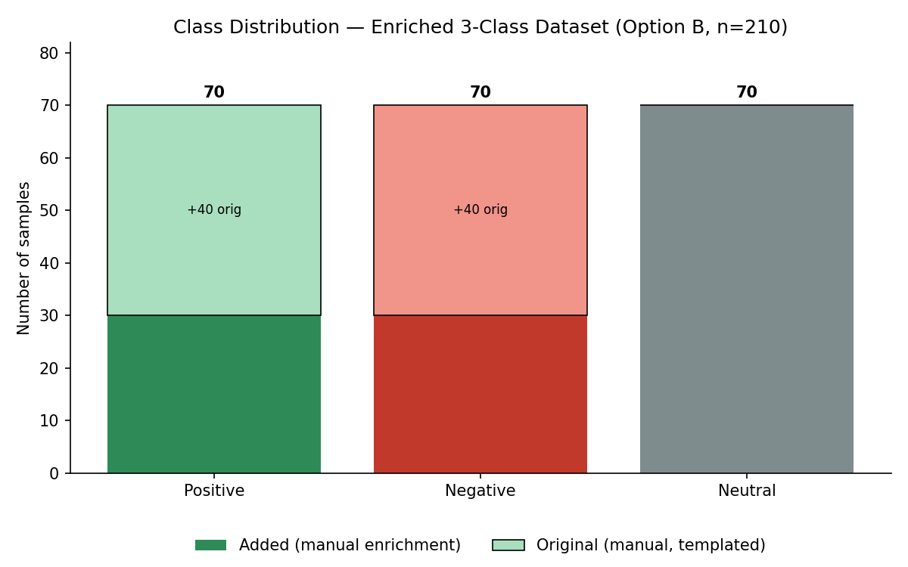

# Data Card — Enriched 3-Class Sentiment Dataset (Option B)

**Project:** sentiment-analysis-project · **Branch:** `feature/dataset-expansion`
**Approach:** **Option B — Dataset Enrichment** (manual, no external dataset)
**Version:** 1.0 (3-class: Positive / Negative / Neutral)
**Built by:** `scripts/make_dataset.py` (deterministic)

---

## 1. Dataset Sources

This dataset **enriches** the original project dataset by hand. The original
sentences are kept unchanged; new manually-authored sentences are added to
introduce a Neutral class, increase linguistic diversity, and add challenging
cases. **No external/public dataset is used** — this is pure Option B.

### Original dataset source
- **Name:** Original manual customer-feedback set (prior tasks).
- **Origin:** Authored for the project from a few sentence templates
  (e.g. *"A {adjective} {noun} overall."*).
- **Size:** 80 sentences (40 Positive, 40 Negative).
- **Role:** kept in full, tagged `source = original_manual`, `category = template`.

### Additional samples (manual enrichment)
- **Name:** Manual enrichment set (authored for this task).
- **Origin:** Written and labelled by hand in `scripts/enriched_samples.py`.
- **Size:** 130 sentences (30 Positive, 30 Negative, 70 Neutral).
- **Purpose / what each adds (the four Option B goals):**
  - **Neutral class:** 70 genuinely non-polar sentences (facts, questions,
    instructions, contextual statements).
  - **Linguistic diversity:** varied syntax, contractions, idioms, colloquial
    phrasing, intensifiers, comparatives — breaking the original's rigid templates.
  - **Challenging examples:** negation, sarcasm/irony, mixed sentiment, implicit
    sentiment (no explicit polarity words), hyperbole.
  - **Documentation:** every row carries a `category` tag (34 distinct
    categories) recording *why* it was added.

### Licensing information
- All data is **authored for this project**; no third-party data and no external
  licence obligations. Free to use and redistribute within the project.

### Annotation guideline (for consistency)
- Label = the writer's **overall** sentiment toward the product/service.
- Sarcasm is labelled by **intended** meaning, not surface words.
- Mixed sentiment is labelled by the overall verdict; balanced-with-no-verdict
  would be Neutral.
- Facts, questions, and instructions carry no polarity → **Neutral**.

---

## 2. Dataset Statistics

| Statistic | Value |
|---|---|
| Total samples | **210** |
| Number of classes | **3** (Positive, Negative, Neutral) |
| Samples per class | **70 / 70 / 70** (balanced) |
| Original retained | 80 (40 Pos, 40 Neg) |
| Manually added | 130 (30 Pos, 30 Neg, 70 Neu) |
| Distinct enrichment categories | 34 |
| Reproducibility | deterministic build; `scripts/make_dataset.py` |

### Samples per class (provenance breakdown)

| Class | Original (template) | Added (manual enrichment) | Total |
|---|---|---|---|
| Positive | 40 | 30 | 70 |
| Negative | 40 | 30 | 70 |
| Neutral | 0 | 70 | 70 |
| **Total** | **80** | **130** | **210** |

---

## 3. Class Distribution

Balanced at 70 per class. The chart (`class_distribution.png`) shows each class
split into the original templated portion and the added manual-enrichment portion.

---

## 4. Preprocessing

### Dataset-build (`make_dataset.py`)
- Combine original 80 + 130 enriched; tag `source` and `category`.
- Deterministic sort for reproducible ordering. No randomness, no filtering
  (all authored samples are intentional).

### Model preprocessing (`preprocessing.py`, unchanged)
- **Tokenization:** NLTK `word_tokenize`.
- **Lowercasing:** applied.
- **Negation handling:** negation marking (`not good` → `not neg_good`); scope
  closes at punctuation / contrast words.
- **Stop-word handling:** sentiment-aware list (keeps `not`, `never`, `but`,
  `very`, …).
- **Normalisation:** WordNet lemmatization, preserving the `neg_` prefix.
- **Decision:** identical to the previous task's best configuration, held fixed
  so result changes are attributable to the **data**, not the model.

---

## 5. Known Limitations

### Remaining biases
- **Author bias:** all enrichment was written by one author, so vocabulary and
  phrasing reflect a single style — a real annotation-consistency risk.
- **Domain bias:** still product/service feedback only; no social media,
  hospitality, finance, or non-English text.

### Coverage gaps
- The data is **authored, not real**, so it lacks the messiness, typos, and
  unpredictability of genuine user text.
- Challenging categories (sarcasm, mixed) are present but in small numbers.
- English only; short sentences only.

### Label-quality concerns
- Sarcasm and mixed-sentiment labels are **judgement calls**; a different
  annotator might disagree on some.
- The **Neutral** class is lexically distinctive (questions, factual nouns), which
  makes it *artificially easy* to classify (see Analysis) — authored neutral text
  is cleaner than real neutral text would be.

### Dataset risks
- **Small:** 210 samples; 5-fold CV on this size is noisy (the original-only
  subset swings ~5 points just from fold composition).
- **Separability artifact:** because examples are authored, the model may key on
  surface cues (e.g. "?" for Neutral) rather than true sentiment understanding.
- The 80 templated originals remain trivially easy and slightly inflate scores.
